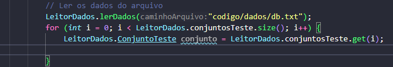
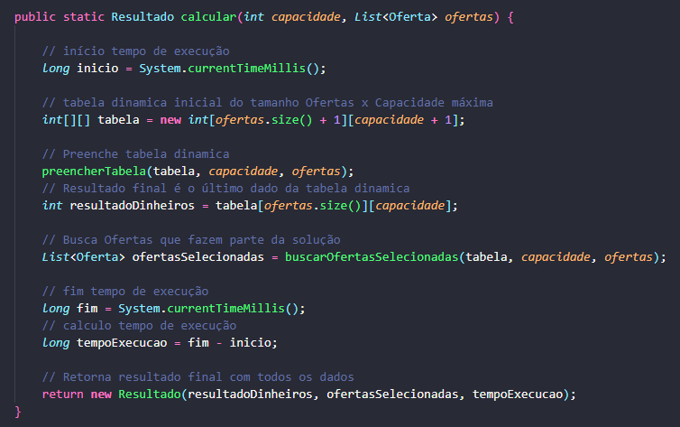
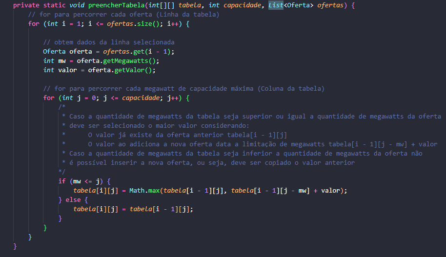
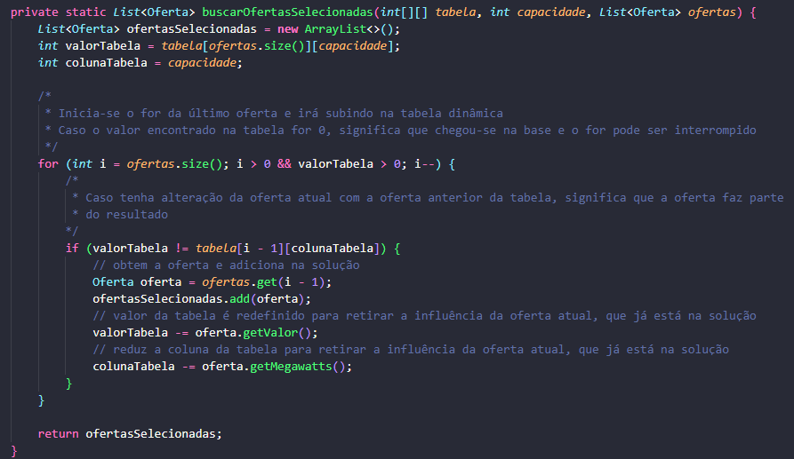
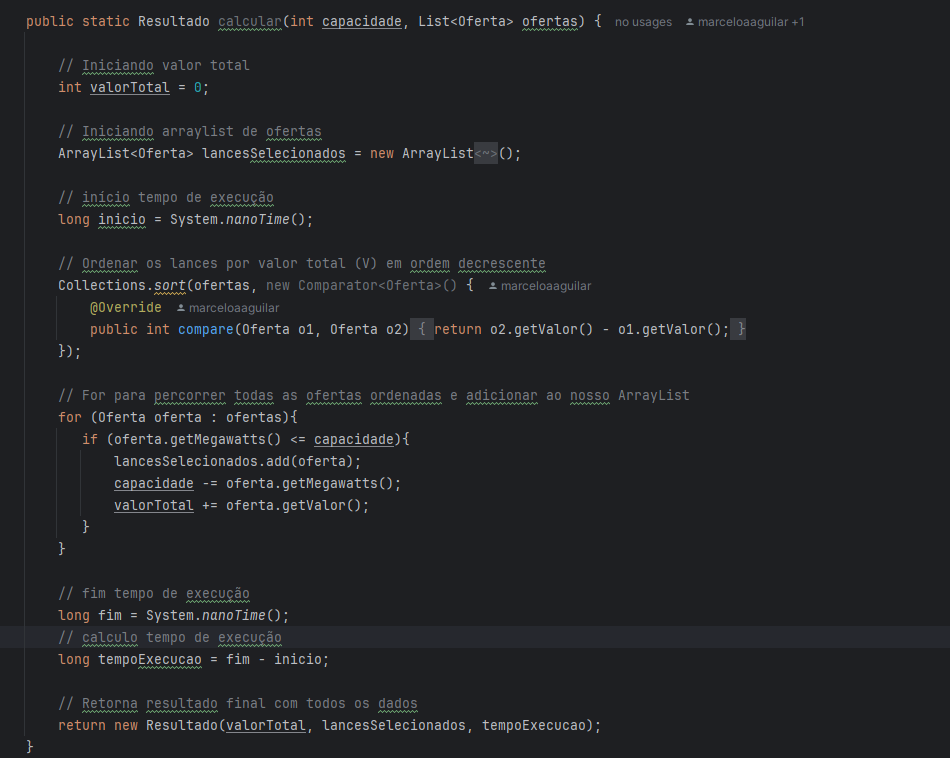
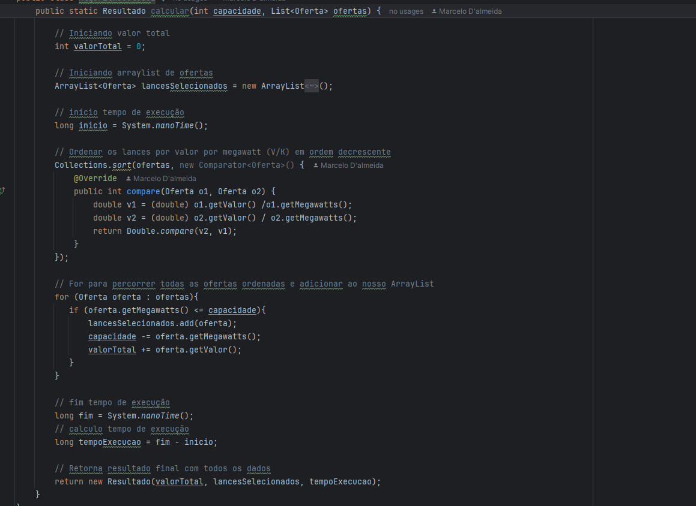
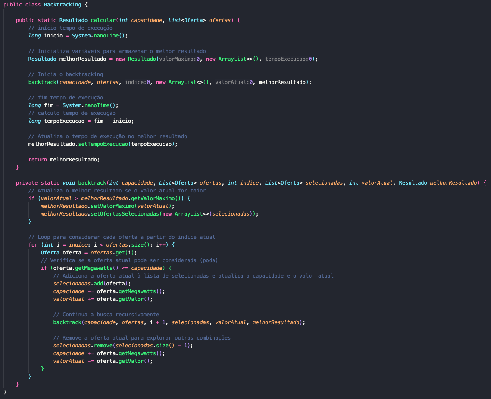

# Dados e relatórios sobre a implementação e resultados

### Responsabilidades

Aluno                               | Desenvolvimento
----------------------------------- | -------------------------
Emmanuel Viglioni                   | Divisão e Conquista
Lucas Machado de Oliveira Andrade   | Programação Dinâmica
Marcelo Aguilar Araújo D'Almeida    | Algorítmo Guloso
Paulo Victor Pimenta Rubinger       | Backtracking

### Arquitetura utilizada

Com o objetivo de centralizar os dados e calcular de forma coesa os valores obtidos para cada tipo de implementação foram gerados classes genéricas que auxiliam na obtenção dos resultados e são utilizadas para todas as técnicas de solução para o problema.

#### Leitura dos Dados e Dados de Teste

Para centralizar a leitura dos dados e os dados de testes utilizados foi criado a classe LeitorDados.java que possui como objetivo obter todas as ofertas, assim como o limite de vendas em megawatts escritos no arquivo db.txt.

O arquivo db.txt apresenta a seguinte configuração e atua como um banco de dados local:

* O primeiro dado é o limite de megawatts do problema;
* Os dados seguintes são informações do nome da empresa interessada, a quantidade de megawatts e a quantia em dinheiro, respectivamente e separados por ponto e vírgula;
* Caso deseje fazer mais casos de testes basta que na próxima linha seja adicionado o novo limite, seguido pelos dados das empresas interessadas novamente.

No exemplo abaixo do db.txt é gera dois casos de testes para as mesmas empresas, o primeiro com limite de 1000 megawatts para venda e o segundo com 2000 megawatts.

``` txt
1000
I1;500;500
I2;500;510
I3;400;520
I4;300;400
I5;200;220
I6;900;1110
2000
I1;500;500
I2;500;510
I3;400;520
I4;300;400
I5;200;220
I6;900;1110
```

Dentro do leitor de dados é gerado uma lista da classe de Conjunto de Testes, cada conjunto de testes contendo a capacidade total e a lista de ofertas.

#### Ofertas e Resultados

Novamente a fim de padronizar as informações de entrada e de saída, para minimizar a diferença de tempo de execução devido a manipulação de dados, toda entrada é gerada por uma List da classe Oferta.java. Sendo que, nessa Oferta há o nome, o megawatts e o valor.

Além disso, toda implementação deve retornar a classe Resultado.java, que possui os dados de valorMaximo, ofertasSelecionadas e tempoExecucao, sendo eles o valor em dinheiro encontrado pela solução, as ofertas que fazem parte da solução e o tempo decorrido do início da execução da solução até o seu término.

#### Gerenciador de Leilao

Por fim, foi criado o GerenciadorLeilao.java, que possui como objetivo a gestão dos métodos de solução.

O gerenciador inicialmente realiza a leitura dos dados no db.txt e gera uma interação para caso caso de teste existente



Dentro dessa interação, é chamado o cálculo de cada método de solução para o problema, que irá receber as informações de capacidade total e ofertas, existentes no conjunto. Esses métodos devem retornar a classe Resultado como resposta, que pode ser visualizada de forma detalhada no método exibirResultados.

### Exemplo teste

**Primeira base de dados:**

EMPRESA | QUANTIDADE    | VALOR
------- | ------------- | -----
E1      | 430           | 1043
E2      | 428           | 1188
E3      | 410           | 1565
E4      | 385           | 1333
E5      | 399           | 1214
E6      | 382           | 1498
E7      | 416           | 1540
E8      | 436           | 1172
E9      | 416           | 1386
E10     | 423           | 1097
E11     | 400           | 1463
E12     | 406           | 1353
E13     | 403           | 1568
E14     | 390           | 1228
E15     | 387           | 1542
E16     | 390           | 1206
E17     | 430           | 1175
E18     | 397           | 1492
E19     | 392           | 1293
E20     | 393           | 1533
E21     | 439           | 1149
E22     | 403           | 1277
E23     | 415           | 1624
E24     | 387           | 1280
E25     | 417           | 1330

**Segunda base de dados:**

EMPRESA | QUANTIDADE    | VALOR
------- | ------------- | -----
E1      | 430           | 1043
E2      | 428           | 1188
E3      | 410           | 1565
E4      | 385           | 1333
E5      | 399           | 1214
E6      | 382           | 1498
E7      | 416           | 1540
E8      | 436           | 1172
E9      | 416           | 1386
E10     | 423           | 1097
E11     | 400           | 1463
E12     | 406           | 1353
E13     | 403           | 1568
E14     | 390           | 1228
E15     | 387           | 1542
E16     | 390           | 1206
E17     | 430           | 1175
E18     | 397           | 1492
E19     | 392           | 1293
E20     | 393           | 1533
E21     | 439           | 1149
E22     | 403           | 1277
E23     | 415           | 1624
E24     | 387           | 1280
E25     | 417           | 1330
E1      | 313            | 1496
E2      | 398            | 1768
E3      | 240            | 1210
E4      | 433            | 2327
E5      | 301            | 1263
E6      | 297            | 1499
E7      | 232            | 1209
E8      | 614            | 2342
E9      | 558            | 2983
E10     | 495            | 2259
E11     | 310            | 1381
E12     | 213            | 961
E13     | 213            | 1115
E14     | 346            | 1552
E15     | 385            | 2023
E16     | 240            | 1234
E17     | 483            | 2828
E18     | 487            | 2617
E19     | 709            | 2328
E20     | 358            | 1847
E21     | 467            | 2038
E22     | 363            | 2007
E23     | 279            | 1311
E24     | 589            | 3164
E25     | 476            | 2480


### Programação Dinâmica

#### Método geral

Para a solução da programação funcionar conforme o padrão foi feito o método calcular que recebe os valores de capacidade total e a lista de ofertas do problema.
Esse código foi dividido, para melhor análise e visualização.

Inicialmente é realizada o início da conta do tempo de execução.

Posteriormente é gerada uma matriz vazia que possue uma linha para cada oferta cadastrada e colunas que se inicia em 0 e finaliza no limite de vendas em megawatts. Formando uma matriz de Ofertas X Capacidade de Venda. Dessa forma, a matriz será preenchida de forma que possua um solução já definida para cada limite de venda até o resultado final desejado.

Após a criação da matriz foi gerada uma função a parte que é responsável por preencher a tabela. Quando finalizado o preenchimento, o último registro, na última linha e última coluna coresponderá ao valor em dinheiros maximizado da solução.

Entretanto, a tabela dinâmica não devolve as ofertas que foram responsáveis por gerar a solução, logo foi feita a parte outra função responsável por buscar a lista de ofertas que fazem parte da solução final.

Por fim é finalizado o tempo de execução, calculado e enviado a resposta em formato de Classe com os dados do resultado final em dinheiro, a lista de ofertas que fazem parte do resultado final e o tempo total de execução.



#### Preenchimento da tabela dinâmica

No preenchimento da tabela dinâmica foi feito dois fors, sendo que o for externo corresponde as ofertas (linhas da tabela) e o interno corresponde aos limites de venda (colunas da tabela)

Para cada linha existente no for interno é obtido os dados da oferta para serem utilizados nas interações da coluna sem precisar utilizar de getters e setters.

Para cada coluna, dado uma oferta, é feita a comparação para avaliar se a quantidade de megawatts da oferta pode ser inserida na célula, ou seja, se não supera o limite de capacidade de venda. Caso supere, significa que a oferta não pode efetuar a compra de energia, pois não há energia disponível para se vender. Nesse caso é repetido o valor da linha anterior.

Entretanto, caso seja possível considerar a oferta deve prevalecer o maior valor entre duas possibilidades:

* As ofertas consideradas anteriormente, existentes na linha anterior tabela[i - 1][j]
* A inserção da nova oferta, com a retirada das ofertas anteriores forem necessárias para adição da nova oferta tabela[i - 1][j - mw] + valor



#### Encontrando a lista de ofertas

Após o preenchimento completo da tabela é necessário realizar a busca dos dados que foram utilizados para obter a solução. Para isso é inicializado os dados que serão analisados a cada interação, assim como uma lista vazia dos resultados, que serão incrementados a cada dado utilizado.

Para descobrir quais dados foram utilizados é necessário analisar cada linha da tabela, iniciando da última oferta gerada pela tabela.
Para reduzir a quantidade de interações, o loop também é interrompido caso chegue na coluna 0, pois isso significa que chegou-se na base e já se tem o resultado final.

Para se obter a resposta basta validar se o valor analisado, que é iniciado como o valor da última célula da tabela, é diferente do seu valor anterior (mesma coluna, linha acima). Caso esses valores sejam diferentes, a oferta analisada foi inserida na resposta, logo ela é adicionada na solução.

Além disso, o valor analisado, que está presente na célula, deve ser atualizado para validar a interação da oferta anterior, além de retornar a coluna analisada também, retirando o valor de megawatts utilizado da solução.

Nesse caso, o novo valorTabela obtido pela retirada da oferta também poderia ser obtido através da célula existe na tabela[ofertaAnalisada - 1][colunaAnalisada - megawatts].



#### Resultados Problema Exemplo

O problema quando verificado a solução, é solucionado pela programação dinâmica em duas etapas.
A primeira etapa está relacionada com o preenchimento da tabela que ocorre n * m interações, sendo n a quantidade de ofertas e m o valor de limite de venda de megawatts, ou seja, nesse caso em que há 6 ofertas e 1000 de limite, há uma performance pior do que seria para n^2 interações. Mas com o aumento da quantiade de ofertas e a manutenção do limite, o comportamente se assemelha a uma interação linear de n interações.

A segunda etapa ocorre na busca pelos dados, que no pior caso, realiza n operações, sendo uma para cada oferta.

Para a primeira base de dados, com 25 registros e 8000 de capacidade, houve tempo de execução médio de 2 milisegundos, obteve-se como resultados as empresas abaixo, com solução final de 26725 dinheiros:

E25 comprou 417 MW por 1330 dinheiros
E24 comprou 387 MW por 1280 dinheiros
E23 comprou 415 MW por 1624 dinheiros
E22 comprou 403 MW por 1277 dinheiros
E20 comprou 393 MW por 1533 dinheiros
E19 comprou 392 MW por 1293 dinheiros
E18 comprou 397 MW por 1492 dinheiros
E16 comprou 390 MW por 1206 dinheiros
E15 comprou 387 MW por 1542 dinheiros
E14 comprou 390 MW por 1228 dinheiros
E13 comprou 403 MW por 1568 dinheiros
E12 comprou 406 MW por 1353 dinheiros
E11 comprou 400 MW por 1463 dinheiros
E9 comprou 416 MW por 1386 dinheiros
E7 comprou 416 MW por 1540 dinheiros
E6 comprou 382 MW por 1498 dinheiros
E5 comprou 399 MW por 1214 dinheiros
E4 comprou 385 MW por 1333 dinheiros
E3 comprou 410 MW por 1565 dinheiros

Para a segunda base de dados, com 50 registros e 8000 de capacidade, houve tempo de execução médio de 3 milisegundos, obteve-se como resultados as empresas abaixo, com solução final de 40348 dinheiros:

E25 comprou 476 MW por 2480 dinheiros
E24 comprou 589 MW por 3164 dinheiros
E23 comprou 279 MW por 1311 dinheiros
E22 comprou 363 MW por 2007 dinheiros
E21 comprou 467 MW por 2038 dinheiros
E20 comprou 358 MW por 1847 dinheiros
E18 comprou 487 MW por 2617 dinheiros
E17 comprou 483 MW por 2828 dinheiros
E16 comprou 240 MW por 1234 dinheiros
E15 comprou 385 MW por 2023 dinheiros
E14 comprou 346 MW por 1552 dinheiros
E13 comprou 213 MW por 1115 dinheiros
E11 comprou 310 MW por 1381 dinheiros
E10 comprou 495 MW por 2259 dinheiros
E9 comprou 558 MW por 2983 dinheiros
E7 comprou 232 MW por 1209 dinheiros
E6 comprou 297 MW por 1499 dinheiros
E4 comprou 433 MW por 2327 dinheiros
E3 comprou 240 MW por 1210 dinheiros
E2 comprou 398 MW por 1768 dinheiros
E1 comprou 313 MW por 1496 dinheiros

#### Aumentando o problema

Com o aumento do problema foi feito validações do tempo médio de execução, considerando sempre a média de 10 conjuntos de testes de mesmo tamanho.

Manutenção do Limite em 1000 Megawatts e aumento da quantidade de ofertas:

Quantidade de Ofertas   | Tempo execução (microsegundos)
----------------------- | -------------------------------
100                     | 396
200                     | 810
300                     | 1412
700                     | 3365
800                     | 4033
900                     | 9997
1000                    | 17471


### Algoritmo Guloso - Estratégia 1 - Ordenação por maior valor

O algoritmo inicialmente faz o inicio da conta do tempo de execução.

Depois disso, ofertas são ordenadas em ordem decrescente de valor. Essa ordenação garante que as ofertas de maior valor sejam consideradas primeiro pelo algoritmo guloso. Após a ordenação, o algoritmo percorre a lista de ofertas ordenadas, verificando para cada oferta se a capacidade restante é suficiente para aceitar a oferta.

Se a capacidade permitir, a oferta é adicionada à lista ofertasSelecionadas, a capacidade disponível é reduzida pelo valor de megawatts da oferta, e o valor da oferta é adicionado ao valorTotal.

Após percorrer todas as ofertas, o algoritmo registra o tempo final de execução e calcula a diferença para determinar o tempo total de execução. Finalmente, o algoritmo retorna um objeto Resultado que contém o valorTotal, a lista de ofertas selecionadas e o tempo de execução.


#### Vantagens - Ordenação por maior valor
- Ao ordenar as ofertas pelo maior valor por megawatt, o algoritmo garante que cada unidade de capacidade seja utilizada da forma mais eficiente possível em termos de valor monetário. Isso significa que as ofertas que proporcionam o maior retorno financeiro para cada megawatt de capacidade são consideradas primeiro.


- A abordagem gulosa baseia-se na premissa de fazer a melhor escolha local em cada etapa do processo. Ordenar pelo maior valor por megawatt permite ao algoritmo fazer essas escolhas locais ótimas de maneira direta e imediata.

#### Desvantagens - Ordenação por maior valor

 - Se a distribuição dos valores por megawatt não seguir uma tendência clara, ordenar apenas por esse critério pode não resultar na melhor solução global.

 
- Em certos cenários, especialmente quando a relação entre valor e capacidade não é linear, a abordagem gulosa pode resultar em soluções subótimas. Isso ocorre porque a estratégia gulosa não revisa decisões anteriores para garantir a otimalidade global.

#### Tempo de Ordenação 
- Foi utilizado na ordenação dos dados a estrutura Colelctions.sort, a qual possui, como referência, o algoritmo TimSort. Esse algoritmo  possui estratégia baseada em divisão e conquista, combinado com inserções em busca binária, devido à isso, ele possui complexidade O(n log n).



### Algoritmo Guloso - Estratégia 2

Para a segunda estratégia, foi optada a ordenação das ofertas de energia com base no valor por megawatt (V/MW) em ordem decrescente. Isso significa que as ofertas mais valiosas por unidade de energia são consideradas primeiro.

Para cada oferta na lista ordenada, o algoritmo verifica se a capacidade restante é suficiente para incluir a oferta. Se for, a oferta é adicionada à lista de lances selecionados, a capacidade disponível é reduzida pela quantidade de megawatts da oferta, e o valor total é aumentado pelo valor da oferta. Esse processo continua até que todas as ofertas tenham sido consideradas ou a capacidade esteja esgotada.

Após percorrer todas as ofertas, o algoritmo registra o tempo de fim e calcula o tempo de execução. Finalmente, retorna um objeto Resultado, contendo o valor total acumulado, a lista de ofertas selecionadas e o tempo de execução.


#### Vantagens - Ordenação por valor do megawatt, de forma decrescente

- Ordenar as ofertas pelo valor do megawatt em ordem decrescente garante que as ofertas mais valiosas por unidade de capacidade sejam consideradas primeiro. Isso leva à maximização do valor total dentro da capacidade disponível.


- A ordenação decrescente permite que o algoritmo guloso faça escolhas imediatas das melhores ofertas disponíveis, resultando em decisões locais ótimas a cada passo.


- A ordenação prévia das ofertas por valor do megawatt em ordem decrescente permite que o algoritmo realize a seleção de forma mais eficiente, evitando a necessidade de revisitar ofertas menos valiosas durante a execução.


#### Desvantagens - Ordenação por valor do megawatt, de forma decrescente

- Se a distribuição dos valores do megawatt não seguir uma tendência clara de decaimento, a ordenação decrescente pode não garantir a seleção das melhores ofertas em termos de valor total.

- Em certos cenários, a abordagem de ordenação decrescente pode levar a soluções subótimas, especialmente quando a relação entre valor e capacidade não é linear e a ordem de seleção das ofertas é crítica.

#### Tempo de Ordenação
- Da mesma forma que na estratégia 1, foi utilizada a estrutura Collections Sort, a qual possui como base o algoritmo Tim Sort, que utiliza a estratégia de divisão e conquista e busca binária para realizar a ordenação dos dados. Possui uma complexidade O(n log n).



### Backtracking

Para a solução do problema de leilão de energia utilizando o algoritmo de Backtracking, o método calcular recebe a capacidade total de megawatts e a lista de ofertas como parâmetros. O objetivo é encontrar a combinação de ofertas que maximize o valor total, sem exceder a capacidade disponível.

O algoritmo começa registrando o tempo de início da execução. Em seguida, inicializa um objeto Resultado com valor máximo zero, uma lista vazia de ofertas selecionadas e tempo de execução zero. A função recursiva backtrack é então chamada para iniciar a busca pela melhor combinação de ofertas.

#### Estrutura da Função Backtracking

A função backtrack é responsável por explorar todas as possíveis combinações de ofertas, verificando se cada combinação resulta em um valor total maior que o atualmente armazenado no melhorResultado. A cada chamada recursiva, a função considera adicionar uma nova oferta à lista de selecionadas, verifica se a capacidade permite essa adição, e atualiza o valor e capacidade restantes.

#### Parâmetros da função backtrack:

capacidade: a capacidade restante de megawatts.
ofertas: a lista de todas as ofertas disponíveis.
indice: o índice da oferta atual sendo considerada.
selecionadas: a lista de ofertas selecionadas até o momento.
valorAtual: o valor total das ofertas selecionadas até o momento.
melhorResultado: o melhor resultado encontrado até o momento.

#### Procedimento da função backtrack:

Se o valorAtual for maior que o valor máximo armazenado no melhorResultado, atualiza o melhorResultado com o novo valor e a lista de ofertas selecionadas.

Para cada oferta a partir do índice atual, verifica se a oferta pode ser considerada sem exceder a capacidade.
Se a oferta for considerada, adiciona-a à lista de selecionadas, atualiza a capacidade e o valor atual, e chama a função recursivamente para continuar a busca.

Após explorar a inclusão da oferta, remove-a da lista de selecionadas e restaura a capacidade e o valor atual para considerar outras combinações.

Após completar a busca, o tempo de execução é registrado e atualizado no melhorResultado, que é então retornado.

### Vantagens do Backtracking
- Exploração Exaustiva: O Backtracking faz uma busca exaustiva e verifica se cada elemento é uma possível solução. Se é, continua e verifica se é uma solução completa, se não, ele retorna e busca outro candidato (poda).
- Flexibilidade: Pode ser adaptado para incluir podas e otimizações adicionais, como heurísticas que aceleram a busca por soluções viáveis.
- Simplicidade: A abordagem recursiva é intuitiva e direta de implementar para problemas de combinação e otimização.

### Desvantagens do Backtracking
- Complexidade Temporal: A abordagem de força bruta pode ser ineficiente para grandes conjuntos de ofertas devido ao crescimento exponencial do espaço de busca.
- Consumo de Memória: A recursão e a necessidade de armazenar múltiplas combinações podem resultar em alto consumo de memória.



### Resultados

Para os testes, incrementou-se o número de empresas interessadas na base de dados até que o tempo de execução fosse aproximadamente 30 segundos. Para 32 empresas, obteve-se um tempo médio de aproximadamente 25 segundos, enquanto que para 33 empresas, o tempo médio foi de aproximadamente 49 segundos.

Ofertas selecionadas considerando 33 empresas:

#### Conjunto 1:
##### Valor máximo que pode ser obtido: 29197 dinheiros
##### Tempo de execução: 49097388292 nanosegundos
* Ofertas selecionadas: 
* E1 comprou 393 MW por 1443 dinheiros
* E2 comprou 383 MW por 1660 dinheiros
* E3 comprou 399 MW por 1299 dinheiros
* E4 comprou 402 MW por 1487 dinheiros
* E5 comprou 380 MW por 1644 dinheiros
* E6 comprou 387 MW por 1181 dinheiros
* E7 comprou 410 MW por 1644 dinheiros
* E9 comprou 423 MW por 1600 dinheiros
* E10 comprou 399 MW por 1697 dinheiros
* E12 comprou 424 MW por 1622 dinheiros
* E15 comprou 425 MW por 1484 dinheiros
* E16 comprou 390 MW por 1678 dinheiros
* E17 comprou 387 MW por 1507 dinheiros
* E19 comprou 406 MW por 1328 dinheiros
* E20 comprou 412 MW por 1463 dinheiros
* E22 comprou 409 MW por 1171 dinheiros
* E23 comprou 392 MW por 1286 dinheiros
* E29 comprou 396 MW por 1439 dinheiros
* E32 comprou 390 MW por 1051 dinheiros
* E33 comprou 391 MW por 1513 dinheiros

#### Conjunto 2:
##### Valor máximo que pode ser obtido: 29166 dinheiros
##### Tempo de execução: 48819586000 nanosegundos
* Ofertas selecionadas: 
* E2 comprou 419 MW por 1428 dinheiros
* E6 comprou 383 MW por 1470 dinheiros
* E8 comprou 392 MW por 1610 dinheiros
* E9 comprou 389 MW por 1435 dinheiros
* E10 comprou 399 MW por 1320 dinheiros
* E12 comprou 393 MW por 1610 dinheiros
* E14 comprou 389 MW por 1231 dinheiros
* E15 comprou 397 MW por 1655 dinheiros
* E16 comprou 388 MW por 1031 dinheiros
* E17 comprou 431 MW por 1492 dinheiros
* E18 comprou 386 MW por 1424 dinheiros
* E21 comprou 388 MW por 1347 dinheiros
* E24 comprou 416 MW por 1481 dinheiros
* E25 comprou 385 MW por 1588 dinheiros
* E27 comprou 410 MW por 1612 dinheiros
* E28 comprou 404 MW por 1551 dinheiros
* E30 comprou 415 MW por 1602 dinheiros
* E31 comprou 396 MW por 1241 dinheiros
* E32 comprou 396 MW por 1486 dinheiros
* E33 comprou 422 MW por 1552 dinheiros

#### Conjunto 3:
##### Valor máximo que pode ser obtido: 28580 dinheiros
##### Tempo de execução: 49919296708 nanosegundos
* Ofertas selecionadas: 
* E2 comprou 389 MW por 1578 dinheiros
* E4 comprou 422 MW por 1362 dinheiros
* E7 comprou 434 MW por 1490 dinheiros
* E8 comprou 396 MW por 1289 dinheiros
* E9 comprou 394 MW por 1580 dinheiros
* E10 comprou 430 MW por 1572 dinheiros
* E11 comprou 399 MW por 1638 dinheiros
* E13 comprou 431 MW por 1432 dinheiros
* E15 comprou 410 MW por 1618 dinheiros
* E18 comprou 394 MW por 1523 dinheiros
* E19 comprou 398 MW por 1332 dinheiros
* E20 comprou 414 MW por 1666 dinheiros
* E21 comprou 417 MW por 1698 dinheiros
* E22 comprou 417 MW por 1300 dinheiros
* E25 comprou 437 MW por 1581 dinheiros
* E26 comprou 427 MW por 1499 dinheiros
* E28 comprou 426 MW por 1286 dinheiros
* E31 comprou 436 MW por 1537 dinheiros
* E32 comprou 440 MW por 1599 dinheiros

#### Conjunto 4:
##### Valor máximo que pode ser obtido: 28055 dinheiros
##### Tempo de execução: 49460485959 nanosegundos
* Ofertas selecionadas: 
* E1 comprou 380 MW por 1240 dinheiros
* E5 comprou 400 MW por 1354 dinheiros
* E6 comprou 398 MW por 1321 dinheiros
* E7 comprou 387 MW por 1289 dinheiros
* E8 comprou 388 MW por 1230 dinheiros
* E10 comprou 412 MW por 1645 dinheiros
* E11 comprou 415 MW por 1424 dinheiros
* E12 comprou 385 MW por 1445 dinheiros
* E14 comprou 409 MW por 1673 dinheiros
* E15 comprou 423 MW por 1448 dinheiros
* E17 comprou 395 MW por 1260 dinheiros
* E18 comprou 413 MW por 1196 dinheiros
* E23 comprou 432 MW por 1697 dinheiros
* E24 comprou 392 MW por 1498 dinheiros
* E25 comprou 388 MW por 1316 dinheiros
* E26 comprou 433 MW por 1525 dinheiros
* E27 comprou 389 MW por 1550 dinheiros
* E28 comprou 386 MW por 1414 dinheiros
* E29 comprou 381 MW por 1289 dinheiros
* E33 comprou 389 MW por 1241 dinheiros

#### Conjunto 5:
##### Valor máximo que pode ser obtido: 29251 dinheiros
##### Tempo de execução: 49547351375 nanosegundos
* Ofertas selecionadas: 
* E1 comprou 425 MW por 1603 dinheiros
* E3 comprou 437 MW por 1616 dinheiros
* E5 comprou 410 MW por 1584 dinheiros
* E6 comprou 399 MW por 1609 dinheiros
* E7 comprou 390 MW por 1674 dinheiros
* E8 comprou 386 MW por 1428 dinheiros
* E9 comprou 382 MW por 1431 dinheiros
* E10 comprou 426 MW por 1430 dinheiros
* E11 comprou 396 MW por 1415 dinheiros
* E12 comprou 439 MW por 1579 dinheiros
* E13 comprou 383 MW por 1427 dinheiros
* E14 comprou 427 MW por 1697 dinheiros
* E16 comprou 392 MW por 1681 dinheiros
* E20 comprou 389 MW por 1418 dinheiros
* E22 comprou 429 MW por 1695 dinheiros
* E23 comprou 440 MW por 1403 dinheiros
* E27 comprou 425 MW por 1439 dinheiros
* E32 comprou 395 MW por 1478 dinheiros
* E33 comprou 397 MW por 1644 dinheiros

#### Conjunto 6:
##### Valor máximo que pode ser obtido: 28489 dinheiros
##### Tempo de execução: 49849577958 nanosegundos
* Ofertas selecionadas: 
* E3 comprou 432 MW por 1532 dinheiros
* E4 comprou 420 MW por 1618 dinheiros
* E5 comprou 413 MW por 1424 dinheiros
* E8 comprou 391 MW por 1497 dinheiros
* E9 comprou 419 MW por 1494 dinheiros
* E10 comprou 429 MW por 1498 dinheiros
* E14 comprou 434 MW por 1481 dinheiros
* E15 comprou 417 MW por 1484 dinheiros
* E17 comprou 416 MW por 1435 dinheiros
* E19 comprou 428 MW por 1487 dinheiros
* E20 comprou 404 MW por 1364 dinheiros
* E21 comprou 411 MW por 1605 dinheiros
* E24 comprou 425 MW por 1661 dinheiros
* E25 comprou 399 MW por 1456 dinheiros
* E26 comprou 408 MW por 1421 dinheiros
* E29 comprou 382 MW por 1459 dinheiros
* E30 comprou 433 MW por 1558 dinheiros
* E31 comprou 422 MW por 1429 dinheiros
* E33 comprou 384 MW por 1586 dinheiros

#### Conjunto 7:
##### Valor máximo que pode ser obtido: 29459 dinheiros
##### Tempo de execução: 48947803000 nanosegundos
* Ofertas selecionadas: 
* E1 comprou 417 MW por 1499 dinheiros
* E2 comprou 425 MW por 1644 dinheiros
* E4 comprou 408 MW por 1652 dinheiros
* E5 comprou 404 MW por 1560 dinheiros
* E7 comprou 403 MW por 1639 dinheiros
* E10 comprou 437 MW por 1655 dinheiros
* E13 comprou 396 MW por 1381 dinheiros
* E16 comprou 388 MW por 1505 dinheiros
* E17 comprou 415 MW por 1622 dinheiros
* E19 comprou 434 MW por 1471 dinheiros
* E21 comprou 384 MW por 1639 dinheiros
* E23 comprou 392 MW por 1424 dinheiros
* E24 comprou 417 MW por 1681 dinheiros
* E25 comprou 432 MW por 1505 dinheiros
* E27 comprou 383 MW por 1566 dinheiros
* E28 comprou 428 MW por 1610 dinheiros
* E30 comprou 402 MW por 1582 dinheiros
* E32 comprou 409 MW por 1329 dinheiros
* E33 comprou 426 MW por 1495 dinheiros

#### Conjunto 8:
##### Valor máximo que pode ser obtido: 28956 dinheiros
##### Tempo de execução: 51562105708 nanosegundos
* Ofertas selecionadas: 
* E1 comprou 380 MW por 1455 dinheiros
* E3 comprou 419 MW por 1486 dinheiros
* E4 comprou 388 MW por 1544 dinheiros
* E5 comprou 394 MW por 1399 dinheiros
* E6 comprou 420 MW por 1592 dinheiros
* E7 comprou 382 MW por 1435 dinheiros
* E8 comprou 389 MW por 1641 dinheiros
* E9 comprou 403 MW por 1441 dinheiros
* E11 comprou 430 MW por 1455 dinheiros
* E14 comprou 429 MW por 1672 dinheiros
* E15 comprou 390 MW por 1669 dinheiros
* E19 comprou 424 MW por 1418 dinheiros
* E20 comprou 420 MW por 1517 dinheiros
* E21 comprou 410 MW por 1458 dinheiros
* E23 comprou 382 MW por 1440 dinheiros
* E28 comprou 426 MW por 1632 dinheiros
* E30 comprou 434 MW por 1629 dinheiros
* E31 comprou 427 MW por 1454 dinheiros
* E33 comprou 439 MW por 1619 dinheiros

#### Conjunto 9:
##### Valor máximo que pode ser obtido: 28176 dinheiros
##### Tempo de execução: 49025411584 nanosegundos
* Ofertas selecionadas: 
* E3 comprou 411 MW por 1677 dinheiros
* E5 comprou 428 MW por 1423 dinheiros
* E6 comprou 389 MW por 1556 dinheiros
* E7 comprou 439 MW por 1370 dinheiros
* E8 comprou 406 MW por 1440 dinheiros
* E9 comprou 387 MW por 1154 dinheiros
* E10 comprou 390 MW por 1649 dinheiros
* E11 comprou 382 MW por 1453 dinheiros
* E12 comprou 404 MW por 1412 dinheiros
* E14 comprou 388 MW por 1539 dinheiros
* E15 comprou 389 MW por 1396 dinheiros
* E17 comprou 402 MW por 1573 dinheiros
* E18 comprou 398 MW por 1277 dinheiros
* E20 comprou 391 MW por 1307 dinheiros
* E21 comprou 398 MW por 1407 dinheiros
* E24 comprou 394 MW por 1149 dinheiros
* E27 comprou 431 MW por 1313 dinheiros
* E28 comprou 391 MW por 1573 dinheiros
* E31 comprou 385 MW por 1173 dinheiros
* E33 comprou 395 MW por 1335 dinheiros

#### Conjunto 10:
##### Valor máximo que pode ser obtido: 28567 dinheiros
##### Tempo de execução: 49374412542 nanosegundos
* Ofertas selecionadas: 
* E2 comprou 402 MW por 1286 dinheiros
* E3 comprou 398 MW por 1662 dinheiros
* E4 comprou 391 MW por 1187 dinheiros
* E5 comprou 381 MW por 1447 dinheiros
* E7 comprou 392 MW por 1653 dinheiros
* E12 comprou 405 MW por 1316 dinheiros
* E13 comprou 380 MW por 1643 dinheiros
* E14 comprou 389 MW por 1407 dinheiros
* E15 comprou 420 MW por 1390 dinheiros
* E16 comprou 428 MW por 1598 dinheiros
* E18 comprou 418 MW por 1672 dinheiros
* E19 comprou 397 MW por 1453 dinheiros
* E22 comprou 384 MW por 1385 dinheiros
* E24 comprou 387 MW por 1107 dinheiros
* E26 comprou 408 MW por 1392 dinheiros
* E28 comprou 402 MW por 1308 dinheiros
* E29 comprou 382 MW por 1540 dinheiros
* E30 comprou 402 MW por 1313 dinheiros
* E31 comprou 431 MW por 1669 dinheiros
* E33 comprou 403 MW por 1139 dinheiros

33 Empresas - Média de tempo de execução: 49560.341912600000 milissegundos